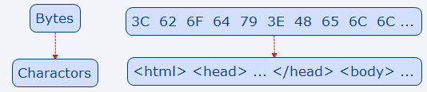

# 浏览器渲染原理
  作为和浏览器打交道最多、依赖浏览器环境的开发人员，学习掌握浏览器底层的渲染原理不仅可以让我们更深入的了解它，也可以让我们在面对性能优化时，更加的有迹可循。

  浏览器的渲染过程是由浏览器内核中的**渲染引擎**处理的，浏览器内核是浏览器运行的**最核心的程序**，分为渲染引擎和js引擎两部分，通常不同浏览器的渲染引擎也是不同的。如：Chrome、Safari中是WebKit，Firefox中是Gecko。接下来学习渲染引擎具体是如何工作的。

## 浏览器渲染页面的过程
  浏览器渲染页面的过程图示(MDN)：
  
  从上图看到浏览器渲染过程可以分为如下步骤:
  1. 解析html并构建DOM树。
  2. 解析CSS并构建CSSOM树。
  3. DOM树和CSSOM树合并生成Render Tree渲染树。
  4. Layout布局阶段，计算节点在页面上的几何信息(位置/大小)。
  5. 根据节点的几何信息将节点绘制到屏幕上。

  接下来我们分析下在这5个阶段具体都做了哪些事情：

### 构建DOM树
  1. 我们写的HTML文件中都是字符串，计算机硬件本身并不认识字符串，所以从本地或网络加载的html文件都会以0和1这样的字节数据传输，但是浏览器会将字节数据转为字符串。
  

  2. 浏览器通过词法分析将字符串转换成Token标记，token本身也是字符串，是构成代码的最小单位。标识标签含义比如：'开始标签'、'结束标签'、'标签内容'等。
  

  3. 生成节点对象，Token转换为Nodes时，只要有多余的Token就会立刻被转为节点对象，而不是等所有Token都转换完成后再生成节点对象。
  
  ```
      3.1 html-token标记转换html节点对象
      3.2 head-token标记转换head节点对象，同时head作为html的子节点。
      3.3 title-token标记转换title节点对象，同时title作为head的子节点。
      3.4 body-token标记转换body节点对象，同时body作为html的子节点。
      3.5 当所有的标记都转为节点，DOM树创建完毕。
  ```
  ```
      注意：
        1. 带有结束标签标示的Token不会生成节点对象。
        2. 节点对象包含节点所有的属性。
  ```

### 构建CSSOM树
CSS解析为CSSOM树过程和DOM解析为DOM树过程一样。
1. 字节数据转为字符串。
2. 字符串转为token标记。
3. token标记转为节点并创建CSSOM树。

例：CSS片段
  ```css
      body {font-size: 16px;}
      p {color: red;}
      p span {display:none;}
      span {font-size: 14px;}
      img {float: right;}
  ```
  经过上面转换的步骤，最终生成的CSSOM：

从图中可以看到子节点继承了父节点的样式，这种树形结构让CSS有层级继承关系，子节点会继承父节点的样式。

### 渲染树生成
DOM树和CSSOM树生成之后，需要两者结合生成Render DOM渲染树。
1. 字节数据转为字符串。
2. 字符串转为token标记。
3. token标记转为节点并创建CSSOM树。

例：渲染树生成
  ```html
  <!doctype html>
  <html>
    <head>
      <meta charset="UTF-8">
      <title>Demos</title>
      <style>
        body {font-size: 16px;}
        p {color: red;}
        p span {display:none;}
        span {font-size: 14px;}
        img {float: right;}
      </style>
    </head>
    <body>
      <p>Hello <span>berwin</span></p>
      <span>Berwin</span>
      
    </body>
  </html>
  ```
  DOM树和CSSOM树合并生成的渲染树：

```
  注意：渲染树只包含可见节点
    1. 不会渲染输出的节点，比如script、meta、link等。
    2. 通过css隐藏的节点。比如display:none，节点不会显示。用visibility和opacity隐藏的节点，还是会显示在渲染树上的。
```

### layout布局和绘制
  渲染树生成后，浏览器会进入布局和绘制阶段。
1. 布局就是计算确定每个节点在页面视窗（Viewport）上的确切尺寸和位置，它的输出是一个“盒模型”，里面准确的捕获每一个元素在页面视窗中的位置和尺寸。
2. 在布局工作完成之后，浏览器会开始绘制，将渲染树转换成屏幕上的绝对像素，这样我们就能在浏览器中看到页面内容。

## 阻塞渲染
  1. CSS阻塞渲染

    CSSOM树的构建不会阻塞DOM树的构建，但是会阻塞渲染树的生成，因为CSS的每一个属性都会影响CSSOM，所以必须等CSSOM构建结束才会进入渲染阶段，因此默认情况下，CSS被视为阻塞渲染的资源。
  2. JavaScript阻塞渲染
  ```
      2.1 JavaScript阻塞DOM构建
        JavaScript可以读取和修改DOM属性，解析过程中如果遇到JavaScript，会把控制权交JS引擎，等JavaScript运行结束，再继续DOM构建。
      2.2 CSSOM阻塞DOM构建
        JavaScript也可以读取和修改CSSOM属性，上文中提到不完整的CSSOM无法使用，遇到CSSOM构建时，将延迟脚本执行和DOM构建，直到CSSOM构建完成。
  ```
  3. defer和async属性
  ```
    注意：defer和async对于内嵌script无效，只对外联src资源有效。
    3.1 defer属性 -- 立即加载延迟执行
        defer表示延迟执行引入的JavaScript脚本，js脚本的引入不会阻塞DOM的构建，会在DOM构建完成且js脚本加载完成后执行js脚本，其中js代码会顺序执行。
    3.2 async属性 -- 
      会异步的加载js脚本，不阻塞DOM构建和后面的渲染操作，只要脚本加载完成就立刻执行，不等待HTML解析或其他操作的完成。所以，如果脚本中有DOM操作，就并不适合。
  ```
## 总结
  本文主要描述浏览器渲染页面的一个大体过程，包括其中HTML/CSS/JavaScript之间互相阻塞的关系，文中如果有不妥之处，希望指正。

## 参考

  [前端不止：Web性能优化 – 关键渲染路径以及优化策略](https://blog.csdn.net/toafu/article/details/80826634)
  [浏览器的渲染：过程与原理](https://zhuanlan.zhihu.com/p/29418126)
  [你真的了解回流和重绘吗](https://segmentfault.com/a/1190000017329980)
  [关键渲染路径](https://mp.weixin.qq.com/s?__biz=MzA5NzkwNDk3MQ==&mid=2650588806&idx=1&sn=408a54e7c8102fd6944c9a40b119015a&chksm=8891d6a2bfe65fb42f493fe9a4dab672dd7e440f31e753196cee0cfbc6696e4f8dd3a669e040&mpshare=1&scene=1&srcid=1228ZrXsmbZKcgCSu7zTVDwy#)
