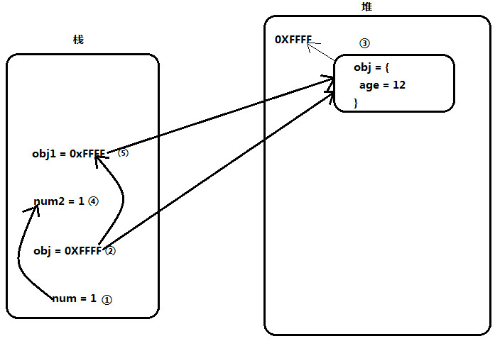

# 深入JavaScript之深浅拷贝
  前几天实习生问了一个问题，他实现完功能发现修改A处值的时候，B处的值也同时被修改了，我发现他代码中其实是想实现A处对象的拷贝，但结果他仅仅只是做了赋值引用，这就导致了对B处的影响。在开发中对于引用类型的拷贝，可能不经意间也会犯像上面的错误，这节就主要学习下JavaScript中的深浅拷贝。

## 栈和堆
  对于我们程序中声明使用的变量，它们都是存储在内存中的，而内存又分为栈内存和堆内存两种类型。
  1. 栈: 
    对于基本数据类型(number/string/boolean/undefined/null/Symbol)的变量而言，它们的值直接保存在栈中。
  2. 堆: 
    对于引用类型(Array/Object/Function)的变量而言，它们的值保存在堆内存中。
  ```js
    例1：
    var num = 1          // 基本类型值存储在栈中
    var obj = {          // 引用类型值存储在堆中
      age: 12
    }
    var num2 = num       // 赋值的是值本身
    var obj1 = obj       // 赋值的是值存储的地址
    obj1.age = 18
    console.log(num2)         // 1
    console.log(obj.age)      // 18
    console.log(obj1.age)     // 18
  ```
  我们通过图解分析上述过程：
  
  ```
    1. 声明num变量存储在栈内存中，并赋值1
    2. 声明obj变量
    3. 在堆内存中分配区域存储{age = 12}，并给内存分配地址(0XFFFF)，同时将地址(0XFFFF)赋值给obj变量，此时obj指向了对象。
    4. 声明变量num2在栈内存中，并赋值num的值1。
    5. 声明变量obj2在栈内存中，并赋值obj的值0XFFFF，此时obj1也指向了堆内存中的{age = 12}，这时obj和obj1通过地址指向了堆内存中的同一片区域。
    6. 由于obj和obj1指向是同一个对象，无论我们修改obj.age还是obj1.age对象都会被修改，这就是上例中为什么最后打印结果都是18的原因。
  ```
  总结：1.对于基本类型变量存储的是值本身。2.对于引用类型变量存储是地址。

## 深浅拷贝
  1. 何为深浅拷贝
  ```
    浅拷贝：变量本身是引用类型，同时它所拥有的属性是基本类型，这种拷贝我们称为浅拷贝。
    深拷贝：变量本身是引用类型，同时它所拥有的属性也是引用类型，这种拷贝我们称为深拷贝。
  ```
  2. 拷贝到底拷贝了什么？
  ```
    从例1中我们可以找到，无论是基本类型还是引用类型，我们拷贝的目的都是产生一份和原始值相同的目标值，只是基本类型可以通过**直接赋值**的方式实现，引用类型需要通过特殊的方式实现。
  ```
  实际开发中对于对象/数组类型的拷贝操作更常见，下面主要讨论下关于数组/对象的深浅拷贝。
### 数组浅拷贝
  我们可以使用数组的slice、concat返回新数组，从而实现数组的浅拷贝。
  1. concat()：方法用于合并两个或多个数组。此方法不会更改现有数组，而是**返回一个新数组**。
  ```js
    例2：
    var arr = ['copy', 1, true, null, undefined]
    // 当与一个空数组合并时，返回新数组与原来一样。
    var arr1 = arr.concat()
    console.log(arr) // ["copy", 1, true, undefined]
    console.log(arr1) // ["copy", 1, true, undefined]
    arr1[0] = 'copyTarget'
    /* 当修改arr1中第一个元素，arr并没有被修改，说明arr、arr1是两个完全相同的元素 */
    console.log(arr) // ["copy", 1, true, undefined]
    console.log(arr1) // ["copyTarget", 1, true, undefined]
  ```
  上例中通过concat合并空数组，结果返回了一个和原始数组完全相同的数组。
  2. slice(begin, end)：方法返回一个新的数组对象，这一对象是一个由 begin(可选)和end(可选,不包括end)决定的原数组的浅拷贝。原始数组不会被改变。
  ```js
    例3：
    // 当从第一个元素开始截取
    var arr1 = arr.slice()
  ```
  上例中通过slice截取数组，结果返回了一个和原始数组完全相同的数组。
  3. 通过ES6的扩展运算法(...)
  ```js
    例4：
    // 先通过扩展运算符获取所有元素，然后用这些元素作为新数组的元素
    var arr1 = [...arr]
  ```
  上例中通过ES6中的**扩展运算符**，结果返回了一个和原始数组完全相同的数组。
### 对象浅拷贝
  对于对象的浅拷贝，可以通过assign()方法实现。
  ```js
    例5：
    var source = { a: 1, b: 2 }
    // 返回一个拥有target属性的对象
    var target = Object.assign({}, source)
    // var target = {...source}
    console.log(source)  // { a: 1, b: 2}
    console.log(target)  // { a: 1, b: 2}
    // 修改a属性值，只有source变化，target并没有改变
    target.a = 3
    console.log(source)  // { a: 1, b: 2}
    console.log(target)  // { a: 3, b: 2}
  ```
  上例中我们使用Object.assign()方法实现了对象的浅拷贝。
### 数组和对象浅拷贝
  上文中实现数组的浅拷贝是使用数组相关的方法，实现对象的浅拷贝使用的是对象相关的方法，我们可否写个通用方法实现数组和对象的浅拷贝？接下来实现下
  ```js
    例6：
    var shallowCopy = function(source) {
      // 只拷贝对象或、数组
      if (typeof source !== 'object') return
      // 判断是对象还是数组的浅拷贝
      var target = source instanceof Array ? [] : {}
      // 遍历source
      for (var key in source) {
          // 判断是否是自身属性
          if (source.hasOwnProperty(key)) {
              target[key] = source[key]
          }
      }
      return target
    }
  ```
  上面我们就实现数组和对象浅拷贝统一方法。已自验通过
  
## 深拷贝
  当数组的元素或者对象的属性是**引用类型**时，上面那些方法就无法实现拷贝最终的目的。
  1. 数组元素是引用类型
  ```js
    例7：
    var arr = [{age: 12}]
    var arr1 = arr.concat()
    arr1[0].age = 18
    console.log(arr)  // [{age: 18}]
    console.log(arr1) // [{age: 18}]
  ```
  当数组的元素是引用类型时，浅拷贝只是完成了数组本身的拷贝，但是arr和arr1中的元素依然指向同一个对象{age: 12}，修改一个另一个也会被修改。
  2. 对象属性是引用类型
  ```js
    例8：
    var source = { a: {name: 'zhangsan'}}
    var target = Object.assign({}, source)
    target.a.name = 'lisi'
    console.log(source)  // { a: {name: 'lisi'}}
    console.log(target)  // { a: {name: 'lisi'}}
  ```
  当对象的属性是引用类型时，浅拷贝只是完成了对象本身的拷贝，但是source和target的属性a依然指向同一个对象{name: 'zhangsan'}，修改一个另一个也会被修改。
### 数组和对象深拷贝
  数组和对象深拷贝方法的实现思路是，基于上面浅拷贝方法shallowCopy，在每次属性拷贝时再对属性类型进行判断，如果是引用类型，就进行递归浅拷贝就可以实现深拷贝。
  ```js
    例9：
    var deepCopy = function(source) {
      if (typeof source !== 'object') return
      var target = source instanceof Array ? [] : {}
      for (var key in source) {
          if (source.hasOwnProperty(key)) {
              // 如果属性是引用类型，对属性再递归执行方法，否则直接赋值
              target[key] = typeof source[key] === 'object' ? deepCopy(source[key]) : source[key]
          }
      }
      return target
    }
  ```
  上面我们就实现数组和对象深拷贝统一方法。已自验通过
## 总结
本文我们主要学习数组/对象的深浅拷贝，通过数组/对象本身的浅拷贝方法实现数组/对象的浅拷贝，最后延伸到数组/对象深浅拷贝的统一方法，实现数组/对象的深浅拷贝。文中如果有任何不妥之处，望指正。