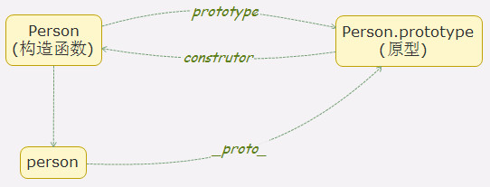
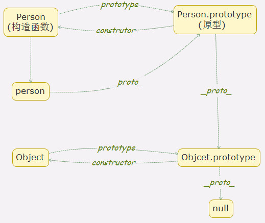

# 深入理解JavaScript之原型、原型链

>在项目和平常的学习中，原型和原型链是无处不在的知识。但到底什么是原型？什么又是原型链？原型和原型链之间又有什么联系？

## 何为原型(prototype)
在JavaScript中每个**函数**都有一个**prototype**(原型)属性,这个属性是一个指针，指向一个对象，这个对象就是调用该函数创建的实例的原型对象。

#### 例1
```js
function Person() {

}
var person = new Person()
// 输出结果是个对象。
console.log(Person.prototype)
```


1、上例中Person.prototype打印输出一个对象，其中的prototype属性指向一个对象。
2、对象中的属性constructor(构造函数)和__proto__，在下面内容继续学习。

我们如何理解“这个对象就是调用该函数创建的**实例**的原型对象”这句话，这时需要引入__proto__这个属性。

## 何为__proto__
JavaScript中每个对象实例(除null)都有__proto__属性，指向对象实例的原型。

为何null除外？
借用<<你不知道的JavaScript>>中对null的解释：null是js中的一个**基本数据类型**,之所以显示为'object'是因为对象在底层被表示为二进制,在js中二进制前三位都为0会被判断为object类型,null的二进制表示全是0,自然前三位是0,所有typeof null会返回'object' 这是语言层面的bug。

null是属于基本数据类型，console打印结果也是‘null’，那么它也就不具备__proto__属性，也就不会有原型对象。
#### 例2
```js
function Person() {

}
var person = new Person()
// 输出结果为true。
console.log(Person.prototype === person.__proto__)
```
1.上例中函数的原型Person.prototype和构造函数Person创建的实例person的原型对象person.__proto__相等，这就解释了原型定义的后半句"这个对象就是调用该构造函数创建的**实例**的原型对象"。

## 原型的应用
1.通常我们会将构造函数中通用的方法定义在原型上，而不是定义在构造函数上，这样所有的实例可以共享一个方法，而无需每个实例都定义一个同样的方法从而达到复用。
2.原型实现继承，关于继承不展开，之后关于继承单独学习。
#### 例3
```js
function Person(name, age) {
  this.name = name
  this.age = age
}
Person.prototype.sayHello(){
  console.log('hello')
}
var person1 = new Person('jack', '27')
var person2 = new Person('Rose', '25')
// person实例中没有sayHello方法，调用原型上的sayHello()方法，所有实例共享同一个方法。
person1.sayHello()
person2.sayHello()
```
## constructor
在例1中我们打印Person.prototype对象中有个constructor属性，它就是原型对象指向构造函数的属性。
```js
function Person() {

}
// 输出结果为true
console.log(Person.prototype.constructor === Person)
```
我们总结下构造函数、原型、实例对象之间的关系。
构造函数通过prototype属性指向原型对象，通过new构造函数得到实例，实例通过__proto__指向原型对象，原型对象又通过constructor属性指向构造函数。


## 原型链
上文中我们已经讨论过，每个实例对象都有__proto__属性指向它的原型对象，原型对象也有__proto__属性指向原型对象的原型对象，层层向上直到对象的原型对象为null，我们把这种层层向上查找的结构叫作**原型链**。

**注意**：
  根据定义，null没有原型,并作为原型链中的最后一个环节。
#### 例4
```js
function Person(name, age) {
  this.name = name
  this.age = age
}
Person.prototype.sayHello(){
  console.log('hello')
}
var person1 = new Person('jack', '27')
person1.sayHello = function(){
  console.log('hello1')
}
person1.sayHello()
```
上例中当我们调用sayHello()方法时，直接调用的person实例中定义的方法，当删掉person实例中的sayHello()方法，那么就会去person原型查找是否有sayHello方法，如果有就执行，否无继续查找原型的原型，直到原型为null时原型链查找结束。

原型链的末端到底是谁？
原型对象既然是对象，那么它肯定也是通过Object创建的实例。那么是否Object.prototpye就是原型链的末端？
#### 例5
```js
var obj = new Object()
// 打印输出null
console.log(obj.__proto__.__proto__)
// 打印输出null
console.log(Object.protype.__proto__)
```
上例中输出结果是null，在原型链中Object.prototype就是所有原型链的末端。

图示表示Person完整的原型链：


总结：以上学习了何为原型、原型链，原型、函数、实例对象之间的关系，以及原型链的形成，文中如有不妥之处希望大家指出。

### 补充
JavaScript中函数也是对象，那么函数的原型又是什么？
#### 例6
```js
function foo(){
}
// 打印结果是一个函数
console.log(foo.__proto__)
// 打印结果是true
console.log(foo.__proto__ === Function.prototype)
```
其实JavaScript中函数都是Function的实例，那么foo.__proto__就指向了Function.prototype。根据此条结论也就能解释以下结果：

```js
  // 打印结果是true，Function也是对象
  console.log(Function instanceof Object)
  // 打印结果是true，Function也是函数
  console.log(Function instanceof Function)
  // 打印结果是true，Object也是一个构造函数
  console.log(Object instanceof Function)
  // 打印结果是true，Object是函数是Function的实例
  console.log(Object.__proto__ === Function.prototype)
  // 打印结果是true
  console.log(Function.__proto__ === Function.prototype)
  // 打印结果是true
  console.log(Function.prototype.__proto__ === Object.prototype)
```
instanceof的判断规则是：沿着左侧的__proto__这条线来找，同时沿着右侧的prototype这条线来找，如果两条线能找到同一个引用，即同一个对象，那么就返回true。如果找到终点还未重合，则返回false。
