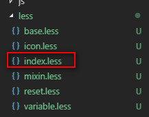

# 在vue项目中的main.js中引入less文件，报not fount的错误
  今天自己搭vue项目的时候，我把写好的less文件import到main.js中后，
  

  但是项目一直报错
  
  
  报错提示我找不到'./common/less/index.less'文件，但是路径下明明有这个文件啊，怎么肥事？
  

  在网上查了才知道，原因：当前项目版本（Vue 2.5.2）已经在build/utils里配置里less的处理。所以之前在build/webpack.base.conf.js配置的less-loader 冲突了。导致结果报错。
  

  我们需要做的就是删除我们在webpack.base.config.js文件中的less选项
  
  
  **注意**：上面这几步结束之后，我们需要重启服务才会生效。

## 总结
上文主要就记录了自己开发过程中遇到的less导入错误，这个错误个人很难想到是因为文件配置的冲突导致，希望这篇文章能够帮助到你，既然到这里不妨再看看我其他的文章，如果觉得对你有帮助，欢迎star。